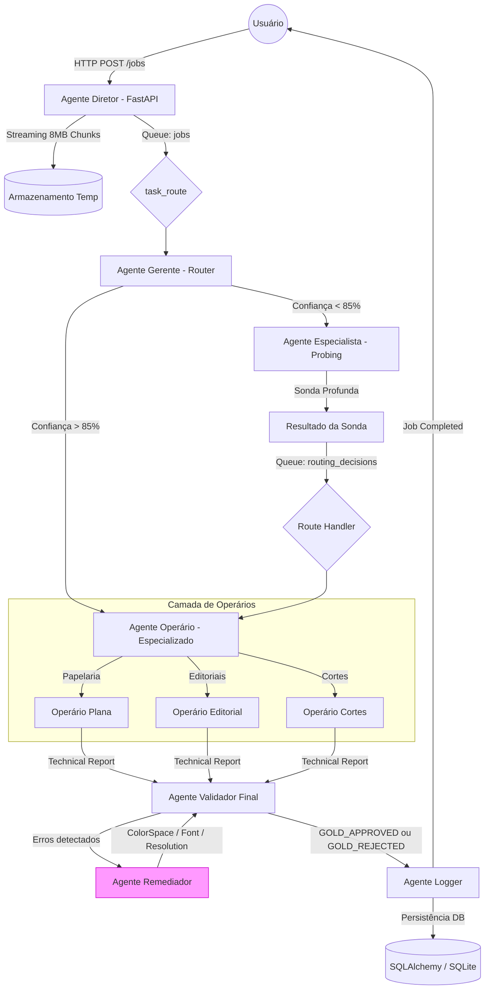

# Arquitetura Técnica — Multi-Agent Pipeline

O Graphic-Pro utiliza uma arquitetura de múltiplos agentes especializados e determinísticos, orquestrados via **Celery + Redis**, garantindo escalabilidade e isolamento de falhas.

## 🏗️ Fluxograma de Dados Completo

Este diagrama ilustra a jornada de um arquivo desde o upload via API até a entrega final com o atestado VeraPDF.

> **Estado atual (pré-Sprint A):** O Remediador executa apenas `ColorSpaceRemediator`, `FontRemediator` e `ResolutionRemediator`. `BleedRemediator` (G002) e `SafetyMarginRemediator` (E004) ainda não estão implementados. O container VeraPDF (Sprint C) também não existe — a auditoria PDF/X-4 usa o check pragmático interno (`pdfx_compliance.py`).

---

## 🧩 Componentes Principais

### 1. Agente Diretor (API)
- **Localização**: `app/api/routes_jobs.py`
- **Responsabilidade**: Receber uploads via streaming (Anti-OOM), gerenciar o ciclo de vida do job e expor status via polling.
- **Protocolo**: RFC 9457 (Problem Details) para erros.

### 2. Agente Gerente (Router)
- **Localização**: `agentes/gerente/agent.py`
- **Responsabilidade**: Classificar o produto gráfico (Editorial, Papelaria, etc.) usando metadados rápidos (ExifTool) e geometria básica.
- **Saída**: `RoutingPayload` com nível de confiança.

### 3. Agente Especialista (Probing)
- **Responsabilidade**: Acionado quando o Gerente tem baixa confiança. Realiza inspeção pesada com Ghostscript/PyMuPDF para determinar a natureza do arquivo.
- **Obs**: Implementa a **Rule 3** (Prevenção de Deadlock), publicando em uma fila dedicada de decisões de roteamento.

### 4. Agente Validador & Remediador
- **Validador**: Compara os dados técnicos contra a `messages_table.py` (GWG Compliant).
- **Remediador**: Executa a lógica de "Inversão de Contrato", aplicando corretores (Mirror-Edge, Shrink, etc.) de forma determinística.

---

## 🚦 Gestão de Filas (Celery Strategy)

O sistema utiliza filas dedicada para evitar que tarefas curtas sejam bloqueadas por tarefas longas de processamento PDF:

| Fila | Agente | Prioridade | Status |
|:---:|:---:|:---:|:---:|
| `queue:jobs` | Diretor / Gerente | Alta | Implementado |
| `queue:especialista` | Especialista (Probing) | Média | Implementado |
| `queue:routing_decisions` | Route Handler (anti-deadlock) | Alta | Implementado |
| `queue:operario_papelaria_plana` | Operário Papelaria | Média | Implementado |
| `queue:operario_editoriais` | Operário Editorial | Média | Implementado |
| `queue:operario_dobraduras` | Operário Dobraduras | Média | Implementado |
| `queue:operario_cortes_especiais` | Operário Cortes | Média | Implementado |
| `queue:operario_projetos_cad` | Operário CAD | Média | Implementado |
| `queue:validador` | Validador Final | Alta | Implementado |
| `queue:remediador` | Remediador (cor/fonte/res) | Média | Implementado |
| `queue:validador_final` | Gold layer audit | Alta | Implementado |
| `queue:audit` | Logger / Persistence | Baixa | Implementado |
| `queue:verapdf` | Auditor VeraPDF (JVM) | Baixa | **SPRINT C — pendente** |

---

## 🛠️ Stack Tecnológica Tecnológica

- **Backend**: Python 3.11, FastAPI, Celery 5.3.
- **Processamento PDF**:
    - **Ghostscript**: Auditoria profunda e flattening de transparência.
    - **PyMuPDF**: Manipulação rápida de geometria e metadados.
    - **VeraPDF**: Validação PDF/X-4 autoritativa.
- **Processamento de Imagem**:
    - **pyvips**: Análise de TAC (Total Area Coverage) com baixo consumo de memória.
- **Infraestrutura**:
    - **Redis**: Broker de mensagens e lock distribuído.
    - **Docker Compose**: Orquestração da stack (8 workers, 1 API, 1 VeraPDF Node).

---

> [!IMPORTANT]
> **Fluxo de Dados**: Toda comunicação entre agentes é feita via **Pydantic models** serializados como JSON. Nunca passe objetos complexos ou file handles diretamente pelas filas.
